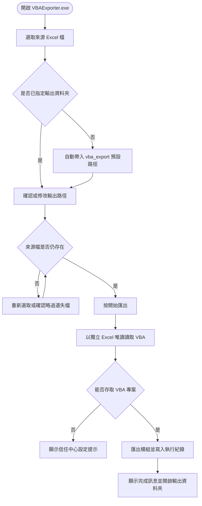
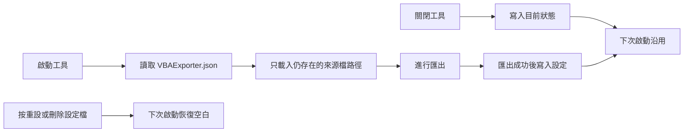
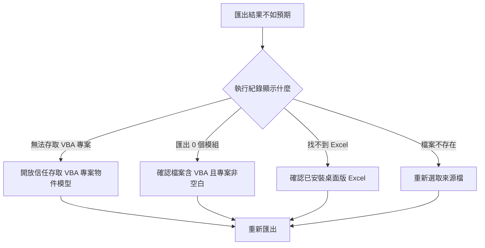

# Excel VBA 模組匯出工具 使用手冊

VBAExporter 是 Windows 桌面工具，可將一個或多個 Excel 活簿中的 VBA 模組匯出成文字檔，方便檢視、備份與版本管理。使用已打包的執行檔時不需要安裝 Python；但電腦必須安裝桌面版 Microsoft Excel。

## 目錄

- [取得與安裝](#取得與安裝)
- [快速開始](#快速開始)
- [整體使用流程](#整體使用流程)
- [操作介面](#操作介面)
- [匯出單一或多個活簿](#匯出單一或多個活簿)
- [匯出結果與檔案格式](#匯出結果與檔案格式)
- [設定記憶與重設](#設定記憶與重設)
- [離線、隱私與資料安全](#離線隱私與資料安全)
- [常見問題與排錯](#常見問題與排錯)
- [維護者驗證與重新建置](#維護者驗證與重新建置)

## 取得與安裝

VBAExporter 是**免安裝**的單一執行檔，取得後即可直接使用，不需要安裝步驟。

### 系統需求

| 項目 | 需求 |
|---|---|
| 作業系統 | Windows |
| 必要軟體 | 桌面版 Microsoft Excel（需已安裝，網頁版無法使用） |
| Python | 使用已打包的執行檔時**不需要** |
| 網路 | 執行匯出時**不需要** |

### 取得執行檔

使用專案中的 `dist\VBAExporter.exe`。將它複製到任何資料夾都能執行；工具會把設定檔 `VBAExporter.json` 放在執行檔所在的同一個資料夾。

### 首次執行的 SmartScreen 提醒

第一次執行時，Windows 可能顯示「未知發行者」的 SmartScreen 警告。若確認檔案來自可信來源，請選擇「更多資訊」→「仍要執行」。

> 若公司政策封鎖未簽章的應用程式，請洽系統管理員處理簽章或應用程式白名單設定。

## 快速開始

1. 確認電腦是 Windows，且已安裝桌面版 Microsoft Excel。
2. 雙擊 `dist\VBAExporter.exe` 開啟工具。
3. 在「1. 選擇來源 Excel 檔（可多選 .xlsm）」按「瀏覽…」，選取要處理的 `.xlsm` 檔案；也可以按住 `Ctrl` 或 `Shift` 一次選取多個檔案。
4. 在「2. 選擇匯出資料夾」按「瀏覽…」指定輸出位置。若你尚未指定過，工具會自動帶入第一個來源檔所在資料夾下的 `vba_export`。
5. 按「開始匯出」，等待「執行紀錄」顯示完成訊息。
6. 匯出完成後，工具會自動開啟輸出資料夾。你也可以查看「執行紀錄」確認每個模組的匯出狀態。

## 整體使用流程



## 操作介面

視窗由上而下分為三個區塊，以及下方的執行紀錄。

### 來源 Excel 檔

顯示目前選取的檔案。選取一個檔案時會顯示完整路徑；選取多個檔案時會顯示檔案數量與部分檔名，並提示會依活簿建立子資料夾。

檔案選擇視窗提供以下篩選：

- 啟用巨集的 Excel：`*.xlsm`（建議）
- 所有 Excel 檔：`*.xls;*.xlsx;*.xlsm`
- 所有檔案：`*.*`

工具會以 VBA 專案可讀取為前提。只有 `.xlsm`（或含巨集的 `.xls`）才可能包含 VBA；選取沒有 VBA 的檔案時，可能不會匯出任何模組。

第一次選取來源檔案、且輸出欄位還是空白時，工具會自動把輸出資料夾設為**第一個選取檔案**所在資料夾下的 `vba_export`。

### 匯出資料夾

可手動輸入路徑，或按「瀏覽…」選取資料夾。第一次選取來源檔案時會自動帶入預設路徑，送出匯出前仍可修改。

### 開始匯出

按下後，**來源檔、輸出資料夾、兩個「瀏覽…」按鈕與「🔄 重設」都會暫時停用**，避免匯出期間改變設定。工作在背景執行，視窗仍會持續更新「執行紀錄」；完成後所有按鈕會恢復可用。

### 重設

「🔄 重設」會清空目前視窗中的來源檔、輸出資料夾與執行紀錄。這是目前工作階段的清除動作；關閉程式時，清除後的空白狀態也會取代原本記住的選擇。若只是想換一個檔案，直接按「瀏覽…」重新選取即可。

### 執行紀錄

顯示每一則帶時間戳的處理訊息，包含開始處理的檔案、每個已匯出的模組、被略過的空白模組，以及任何錯誤。完整狀態對照見[匯出結果與檔案格式](#匯出結果與檔案格式)。

## 匯出單一或多個活簿


### 單一活簿

匯出的模組會直接放在指定的匯出資料夾中。例如選取 `報表.xlsm` 並輸出到 `D:\Export`，模組會放在 `D:\Export`。

### 多個活簿

每個活簿會放到以**原始檔名（不含副檔名）**命名的子資料夾，例如：

```text
D:\Export\
├─ 報表\
│  ├─ Module1.txt
│  └─ Sheet1.txt
└─ 預算\
   ├─ Module1.txt
   └─ UserForm1.frm
```

這樣可避免不同活簿中同名模組互相覆蓋。若來源檔已不存在，工具會在開始前提醒；確認後該檔會被略過，並在執行紀錄標示。

## 匯出結果與檔案格式

| VBA 元件 | 匯出副檔名 | 說明 |
|---|---|---|
| 標準模組 | `.txt` | 例如 `Module1.txt` |
| 類別模組 | `.cls` | 例如 `Class1.cls` |
| UserForm 表單 | `.frm` | Excel 會一併產生對應的 `.frx` 資源檔 |
| 文件模組 | `.txt` | 例如 `ThisWorkbook.txt` 或工作表模組；僅在有程式碼時匯出 |

沒有程式碼的空白文件模組會自動略過。匯出數量與實際成功、失敗的檔案都會顯示在「執行紀錄」及完成訊息中；若只有部分檔案失敗，工具仍會保留成功匯出的結果，並提示查看紀錄。

### 執行紀錄狀態對照

| 執行紀錄訊息 | 意義 |
|---|---|
| `已匯出：<模組><副檔名>` | 該模組成功匯出 |
| `略過空白模組：<模組>` | 文件模組沒有程式碼，自動略過 |
| `[錯誤] 無法存取 VBA 專案` | 信任中心未開放存取，或專案有密碼保護 |
| `[錯誤] 處理失敗` | 該檔案發生未預期錯誤，已跳過 |
| `[警告] 檔案不存在，略過` | 來源檔已遺失，該檔未處理 |
| `完成！共處理 N 個檔案、匯出 M 個模組` | 整個批次結束的總結 |

## 設定記憶與重設

工具會在執行檔旁邊使用 `VBAExporter.json` 記住：

- 上次選取且目前仍存在的來源檔路徑
- 上次使用的匯出資料夾

這個檔案只儲存路徑（JSON 欄位為 `files` 與 `output_dir`），不儲存 Excel 內容或 VBA 程式碼。工具會在**匯出成功後**與**關閉程式時**寫入設定；啟動時只會載入仍然存在的來源檔路徑。

若要清除記住的路徑，請先關閉工具，再刪除執行檔旁的 `VBAExporter.json`，下次啟動便會以空白狀態開始。若執行檔所在資料夾沒有寫入權限，設定可能無法保存，但不會影響當次匯出。



## 離線、隱私與資料安全

- 工具在本機執行，不需要網路連線來進行匯出。
- 來源活簿以唯讀方式開啟，且不更新外部連結；工具不會修改來源 Excel 檔案。
- 工具使用獨立的 Excel 執行個體，不會關閉或接管你已經開啟的 Excel。
- 匯出完成後會關閉工具自己啟動的 Excel 執行個體，避免留下背景 `EXCEL.EXE`。
- 匯出的程式碼文字檔會寫入你指定的資料夾；請依該資料夾的權限與備份政策保護內容。
- 若 VBA 專案有密碼保護，工具不會嘗試破解；請先由檔案擁有者解除保護，並確認有權限匯出內容。

## 常見問題與排錯



### 找不到 Excel

此工具需要桌面版 Microsoft Excel。請確認 Excel 已正確安裝，而不是只有網頁版或其他試算表軟體，然後重新開啟 `VBAExporter.exe`。

### 顯示「無法存取 VBA 專案」

在 Excel 中開啟：

`檔案` → `選項` → `信任中心` → `信任中心設定` → `巨集設定`

勾選「信任存取 VBA 專案物件模型」，按確定後重新執行匯出。若該活簿的 VBA 專案有密碼保護，也必須先解除密碼。

### 匯出結果是 0 個模組

請確認：

1. 選取的是包含 VBA 專案的活簿，通常是 `.xlsm`。
2. VBA 專案不是空白專案（純資料活簿、只有空白文件模組都不會有輸出）。
3. Excel 已開放「信任存取 VBA 專案物件模型」。
4. 執行紀錄中沒有顯示存取失敗或其他錯誤。

### 原始檔被移動或刪除了

工具會在匯出前提醒遺失檔案。請取消後重新按「瀏覽…」選取正確檔案；若選擇繼續，遺失檔案會被略過，其他仍存在的檔案照常處理。

### 輸出資料夾沒有自動開啟

匯出結果仍會寫入指定位置。請從執行紀錄複製或查看輸出路徑，再用檔案總管手動開啟；若路徑無法寫入，請改用有權限的資料夾後重試。

### 視窗大小與螢幕解析度

工具會依螢幕 DPI 自動放大並置中視窗，因此在高解析度螢幕上，視窗尺寸會比一般螢幕大，這是正常行為。

### SmartScreen 阻擋執行

若確認執行檔來自可信來源，請在警告畫面選擇「更多資訊」→「仍要執行」。若公司政策不允許，請洽系統管理員處理簽章或應用程式白名單設定。

## 維護者驗證與重新建置

一般使用者不需要執行本節。若 `dist\VBAExporter.exe` 不存在，或需要從原始碼重新產生執行檔，請在 Windows 上使用以下方式。

### 一鍵建置

雙擊專案根目錄的 `build.bat`。腳本會依序：

1. 尋找可用的 Python（`python` 或 `py -3`）。
2. 檢查並安裝缺少的 `pywin32`、`pyinstaller`、`pillow`（優先依 `requirements.txt` 安裝）。
3. 執行 `make_icon.py` 重新產生圖示。
4. 確認 `VBAExporter.exe` 沒有正在執行。
5. 以 PyInstaller 建置 `dist\VBAExporter.exe`。

建置前請先關閉正在執行的 `VBAExporter.exe`。自動化流程可使用：

```bat
build.bat /ci
```

`/ci` 會停用等待按鍵與建置完成後自動開啟資料夾的行為。

### 手動建置

需求為 Python 3.10 以上，以及 `pywin32`、`pyinstaller`、`pillow`：

```powershell
pip install -r requirements.txt
python make_icon.py
python -m PyInstaller VBAExporter.spec
```

建置完成後，請確認 `dist\VBAExporter.exe` 存在，再以一個測試用 `.xlsm` 實際操作一次，確認執行紀錄、輸出副檔名及多檔子資料夾行為符合預期。

### 專案主要檔案

```text
export_vba.py        GUI 與 VBA 匯出邏輯
build.bat            一鍵建置腳本
make_icon.py         產生應用程式圖示（icon.ico / icon_48.png）
requirements.txt     Python 相依套件清單
VBAExporter.spec     PyInstaller 設定
dist/VBAExporter.exe 打包後的免安裝執行檔
```
