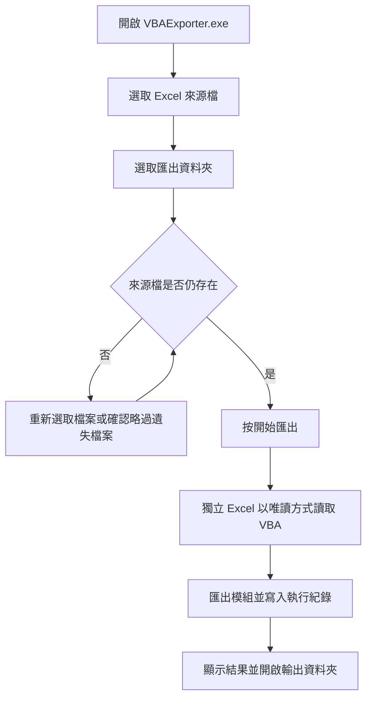

# Excel VBA 模組匯出工具使用手冊

VBAExporter 是 Windows 桌面工具，可將一個或多個 Excel 活簿中的 VBA 模組匯出成文字檔，方便檢視、備份與進行版本管理。使用已打包的執行檔時不需要安裝 Python；但電腦必須安裝桌面版 Microsoft Excel。

## 目錄

- [快速開始](#快速開始)
- [整體使用流程](#整體使用流程)
- [操作介面](#操作介面)
- [匯出單一或多個活簿](#匯出單一或多個活簿)
- [匯出結果與檔案格式](#匯出結果與檔案格式)
- [設定記憶與重設](#設定記憶與重設)
- [離線、隱私與資料安全](#離線隱私與資料安全)
- [常見問題與排錯](#常見問題與排錯)
- [維護者驗證與重新建置](#維護者驗證與重新建置)

## 快速開始

1. 確認電腦是 Windows，且已安裝桌面版 Microsoft Excel。
2. 雙擊 `dist\VBAExporter.exe` 開啟工具。
3. 在「1. 選擇來源 Excel 檔」按「瀏覽…」，選取要處理的 `.xlsm` 檔案；也可以按住 `Ctrl` 或 `Shift` 一次選取多個檔案。
4. 在「2. 選擇匯出資料夾」按「瀏覽…」，指定輸出位置。
5. 按「開始匯出」，等待「執行紀錄」顯示完成訊息。
6. 工具完成後會自動開啟輸出資料夾；也可以直接查看執行紀錄確認每個模組的匯出狀態。

首次執行若看到 Windows SmartScreen 的「未知發行者」提醒，請確認檔案來源可信，再選擇「更多資訊」→「仍要執行」。

## 整體使用流程



## 操作介面

### 來源 Excel 檔

顯示目前選取的檔案。選取一個檔案時會顯示完整路徑；選取多個檔案時會顯示檔案數量與部分檔名，並提示會依活簿建立子資料夾。

檔案選擇視窗提供以下篩選：

- 啟用巨集的 Excel：`*.xlsm`
- 所有 Excel 檔：`*.xls;*.xlsx;*.xlsm`
- 所有檔案：`*.*`

工具會以 VBA 專案可讀取為前提；若選取的 Excel 檔沒有 VBA，可能不會匯出任何模組。

### 匯出資料夾

可輸入路徑或按「瀏覽…」選取資料夾。第一次選取來源檔案而尚未指定輸出位置時，工具會預設使用來源檔所在資料夾下的 `vba_export` 資料夾；送出匯出前仍可修改。

### 開始匯出

按下後，來源檔、輸出資料夾與瀏覽按鈕會暫時停用，避免匯出期間改變設定。工作在背景執行，視窗仍會持續更新「執行紀錄」。完成後按鈕會恢復可用。

### 重設

「🔄 重設」會清空目前視窗中的來源檔、輸出資料夾與執行紀錄。這是目前工作階段的清除動作；關閉程式時，清除後的狀態也會取代原本記住的選擇。若只是想換一個檔案，直接按「瀏覽…」重新選取即可。

## 匯出單一或多個活簿


### 單一活簿

匯出的模組會直接放在指定的匯出資料夾中。例如選取 `報表.xlsm` 並輸出到 `D:\Export`，模組會放在 `D:\Export`。

### 多個活簿

每個活簿會放到以原始檔名命名的子資料夾，例如：

```text
D:\Export\
├─ 報表\
│  ├─ Module1.txt
│  └─ Sheet1.txt
└─ 預算\
   ├─ Module1.txt
   └─ UserForm1.frm
```

這樣可避免不同活簿中同名模組互相覆蓋。若來源檔已不存在，工具會在開始前提醒；確認後該檔會被略過，並在執行紀錄標示。

## 匯出結果與檔案格式

| VBA 元件 | 匯出副檔名 | 說明 |
|---|---:|---|
| 標準模組 | `.txt` | 例如 `Module1.txt` |
| 類別模組 | `.cls` | 例如 `Class1.cls` |
| UserForm 表單 | `.frm` | Excel 會一併產生對應的 `.frx` 資源檔 |
| 文件模組 | `.txt` | 例如 `ThisWorkbook.txt` 或工作表模組；僅在有程式碼時匯出 |

沒有程式碼的空白文件模組會自動略過。匯出數量與實際成功、失敗的檔案都會顯示在「執行紀錄」及完成訊息中；若只有部分檔案失敗，工具仍會保留成功匯出的結果，並提示查看紀錄。

## 設定記憶與重設

工具會在執行檔旁邊使用 `VBAExporter.json` 記住：

- 上次選取且目前仍存在的來源檔路徑
- 上次使用的匯出資料夾

這個檔案只儲存路徑，不儲存 Excel 內容或 VBA 程式碼。若要清除記住的路徑，請先關閉工具，再刪除執行檔旁的 `VBAExporter.json`，下次啟動便會以空白狀態開始。若執行檔所在資料夾沒有寫入權限，設定可能無法保存，但不會影響當次匯出。


## 離線、隱私與資料安全

- 工具在本機執行，不需要網路連線來進行匯出。
- 來源活簿以唯讀方式開啟，且不更新外部連結；工具不會修改來源 Excel 檔案。
- 工具使用獨立的 Excel 執行個體，不會關閉或接管你已經開啟的 Excel。
- 匯出完成後會關閉工具自己啟動的 Excel 執行個體，避免留下背景 `EXCEL.EXE`。
- 匯出的程式碼文字檔會寫入你指定的資料夾；請依該資料夾的權限與備份政策保護內容。
- 若 VBA 專案有密碼保護，工具不會嘗試破解；請先由檔案擁有者解除保護，並確認有權限匯出內容。

## 常見問題與排錯

### 找不到 Excel

此工具需要桌面版 Microsoft Excel。請確認 Excel 已正確安裝，而不是只有網頁版或其他試算表軟體，然後重新開啟 `VBAExporter.exe`。

### 顯示「無法存取 VBA 專案」

在 Excel 中開啟：

`檔案` → `選項` → `信任中心` → `信任中心設定` → `巨集設定`

勾選「信任存取 VBA 專案物件模型」，按確定後重新執行匯出。若該活簿的 VBA 專案有密碼保護，也必須先解除密碼。

### 匯出結果是 0 個模組

請確認：

1. 選取的是包含 VBA 專案的活簿，通常是 `.xlsm`。
2. VBA 專案不是空白專案。
3. Excel 已開放「信任存取 VBA 專案物件模型」。
4. 執行紀錄中沒有顯示存取失敗或其他錯誤。

### 原始檔被移動或刪除了

工具會在匯出前提醒遺失檔案。請取消後重新按「瀏覽…」選取正確檔案；若選擇繼續，遺失檔案會被略過，其他仍存在的檔案照常處理。

### 輸出資料夾沒有自動開啟

匯出結果仍會寫入指定位置。請從執行紀錄複製或查看輸出路徑，再用檔案總管手動開啟；若路徑無法寫入，請改用有權限的資料夾後重試。

### SmartScreen 阻擋執行

若確認執行檔來自可信來源，請在警告畫面選擇「更多資訊」→「仍要執行」。若公司政策不允許，請洽系統管理員處理簽章或應用程式白名單設定。

## 維護者驗證與重新建置

一般使用者不需要執行本節。若 `dist\VBAExporter.exe` 不存在，或需要從原始碼重新產生執行檔，請在 Windows 上使用以下方式。

### 一鍵建置

雙擊專案根目錄的 `build.bat`。腳本會依序尋找 Python、安裝缺少的 `pywin32`、`pyinstaller`、`pillow`、重新產生圖示，最後以 PyInstaller 建置 `dist\VBAExporter.exe`。

建置前請先關閉正在執行的 `VBAExporter.exe`。自動化流程可使用：

```bat
build.bat /ci
```

`/ci` 會停用等待按鍵與建置完成後自動開啟資料夾的行為。

### 手動建置

需求為 Python 3.10 以上，以及 `pywin32`、`pyinstaller`、`pillow`：

```powershell
pip install pywin32 pyinstaller pillow
python make_icon.py
python -m PyInstaller VBAExporter.spec
```

建置完成後，請確認 `dist\VBAExporter.exe` 存在，再以一個測試用 `.xlsm` 實際操作一次，確認執行紀錄、輸出副檔名及多檔子資料夾行為符合預期。

### 專案主要檔案

```text
export_vba.py        GUI 與 VBA 匯出邏輯
build.bat            一鍵建置腳本
make_icon.py         產生應用程式圖示
VBAExporter.spec     PyInstaller 設定
dist/VBAExporter.exe 打包後的免安裝執行檔
```

